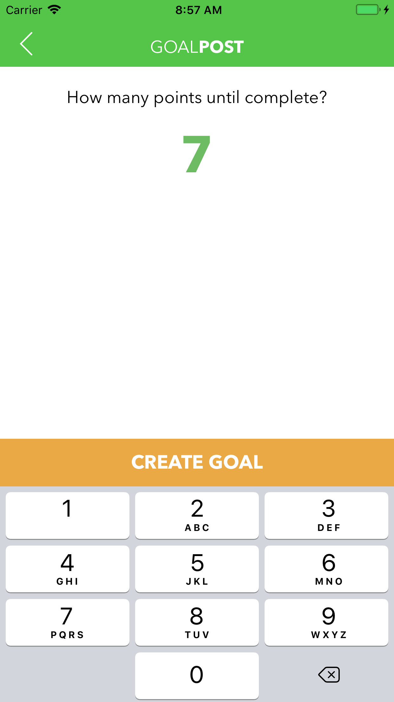

# DevSlopesProj-GoalPost
iOS app demo utilizing Core Data to try to track new goals

Made for the iOS 11 development course from DevSlopes. You can create short-term or long-term goals, with the ability to set how many iterations to perform before the goal is considered completed.

